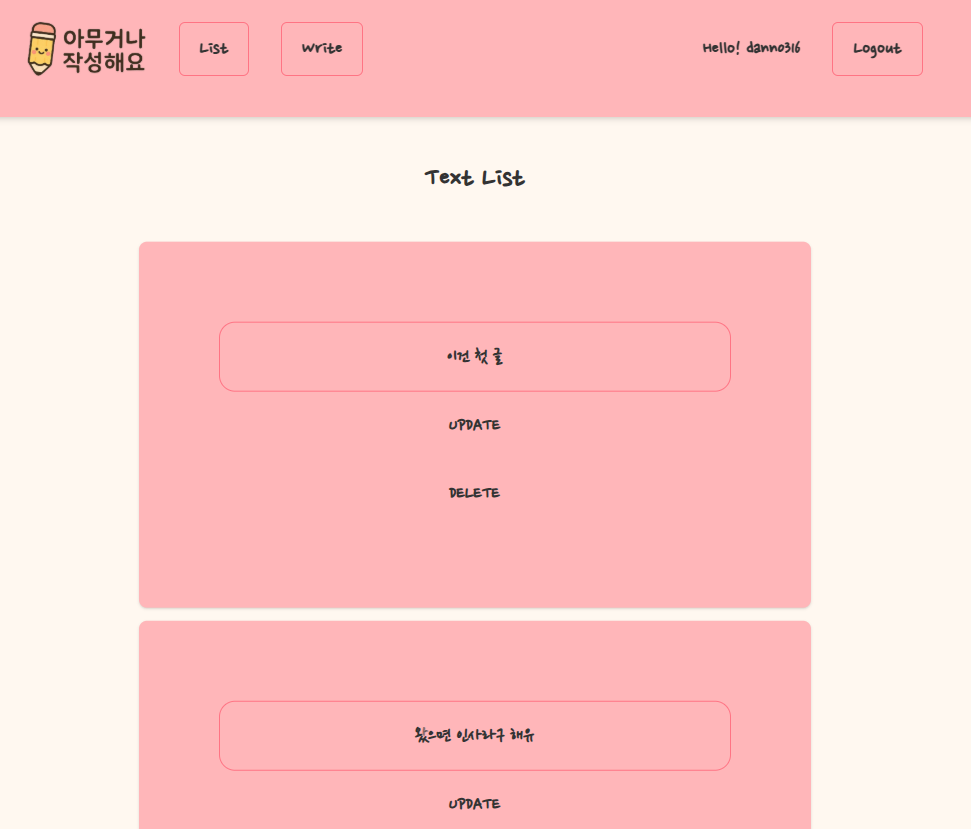
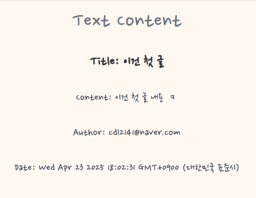
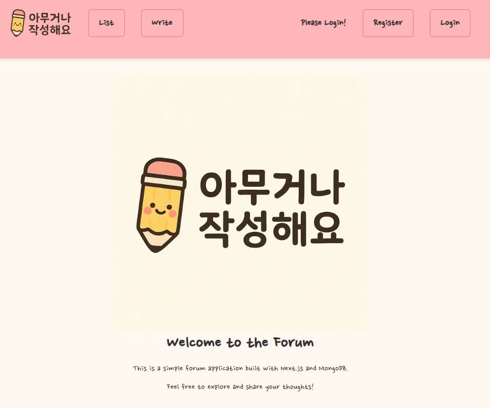
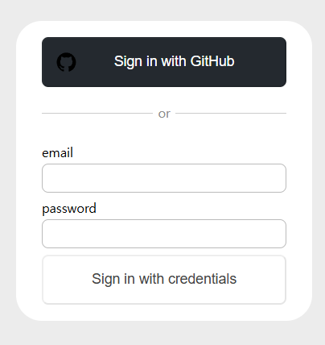
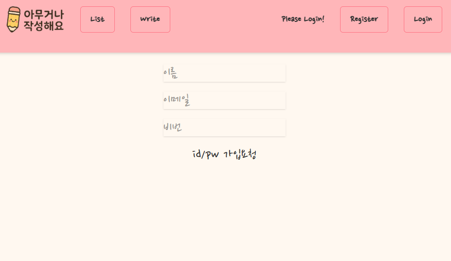

# Next.js + TypeScript  
# WriteAnything (블로그/게시판 서비스)  

: 자유롭게 글을 작성하고 공유할 수 있는 블로그·게시판 서비스  

- 배포 URL: (추가 예정)  

- 기술 스택 : Next.js, TypeScript, Tailwind CSS, MongoDB, NextAuth, Axios

회원가입, 소셜 로그인, ID/PW 로그인, 로그아웃이 가능한 페이지이고, 글을 올리고 글을 볼 수 있으며 해당 글에 댓글까지 달 수 있습니다.

# 아키텍쳐 및 폴더 구조:

> 풀스택 아키텍처 (Next.js 기반)

- Frontend: Next.js App Router 기반 UI/UX, 페이지 라우팅, 상태 관리  

- Backend(API Route): MongoDB CRUD API, 인증 처리, 세션 관리 

> 폴더 구조

project-root/

├── src/

│ ├── app/ # Next.js App Router 페이지 및 라우트

│ │ ├── (auth)/ # 로그인/회원가입 관련 라우트

│ │ ├── posts/ # 게시글 CRUD 페이지

│ │ ├── api/ # 서버 API 라우트 (Next.js server action)

│ │ └── layout.tsx # 전체 레이아웃

│ ├── components/ # 공통 UI 컴포넌트 (Form, PostCard, Modal 등)

│ ├── hooks/ # 커스텀 훅 (세션 관리, 폼 처리 등)

│ ├── lib/ # MongoDB 연결, 유틸 함수

│ ├── types/ # 타입 선언

│ └── styles/ # 전역 스타일, Tailwind 설정

# 설계 전략 설명:

> 로직과 뷰 분리

- 데이터 fetch와 DB 로직은 `lib/`, `api/`에 작성  

- 화면은 UI 컴포넌트와 페이지에서만 담당  

> 인증/보안 (NextAuth)

- GitHub OAuth + 이메일/비밀번호 기반 Credential 로그인 지원  

- 세션 기반 인증으로 페이지 접근 제어 (로그인한 사용자만 글 작성/수정 가능)  

> 게시글 CRUD

- MongoDB를 사용한 게시글 생성(Create), 조회(Read), 수정(Update), 삭제(Delete) 구현 

- 게시글 작성 폼과 리스트, 상세 페이지를 각각 컴포넌트화  

> 재사용 가능한 컴포넌트 구조

- PostCard, PostList, Form, Modal 등을 분리하여 재사용성 확보  

- 상태 관리와 UI를 분리해 유지보수성 강화  

> 댓글 CRUD (진행 중)

## 🚀 주요 기능

- 회원가입, 소셜 로그인, ID/PW 로그인, 로그아웃

- 글 발행

- 글 수정

- 글 목록

- 댓글 발행

- 댓글 수정

- 댓글 삭제

# 어려웠던 점과 해결 방법

> NextAuth 연동

- OAuth와 Credential 방식을 함께 적용하는 과정에서 세션 관리가 복잡했음  

- 해결: NextAuth의 provider 옵션을 명확히 분리하고, 세션 훅(`useSession`)을 통해 접근 제어 로직 단순화  

> DB 연결 문제

- MongoDB 연결 시 서버리스 환경에서 커넥션 풀 관리가 어려움  

- 해결: DB 연결 유틸을 싱글톤 패턴으로 작성해 중복 연결 방지  

> 권한 처리

- 비로그인 사용자가 글을 작성/수정하는 문제 발생  

- 해결: 서버 라우트에서 세션 검증 후 권한 없는 요청 차단 

# 느낀 점 / 한계점

이번 프로젝트를 통해 **풀스택 개발 경험**을 쌓을 수 있었습니다. 단순 프론트엔드 구현을 넘어 백엔드 API, DB, 인증까지 직접 다루면서 전체 서비스 구조를 이해할 수 있었습니다.  

특히 NextAuth와 MongoDB를 다루면서 인증/보안, 데이터 영속성의 중요성을 실감했고, UI와 API를 어떻게 명확히 분리할지 고민하면서 설계 능력도 키울 수 있었습니다.  

다만 아직 게시글 추천, 태그 검색, 댓글 시스템 등 확장 기능은 구현하지 못했습니다. 앞으로는 TanStack Query를 통한 데이터 캐싱, 서버 액션(Server Action) 최적화, 더 나아가 클라우드 배포 경험까지 확장해보고자 합니다.

# 사진

- List Page

- Datail Page

- Home Page

- Login Page

- Credentail Register Page
